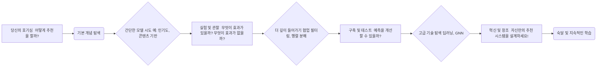
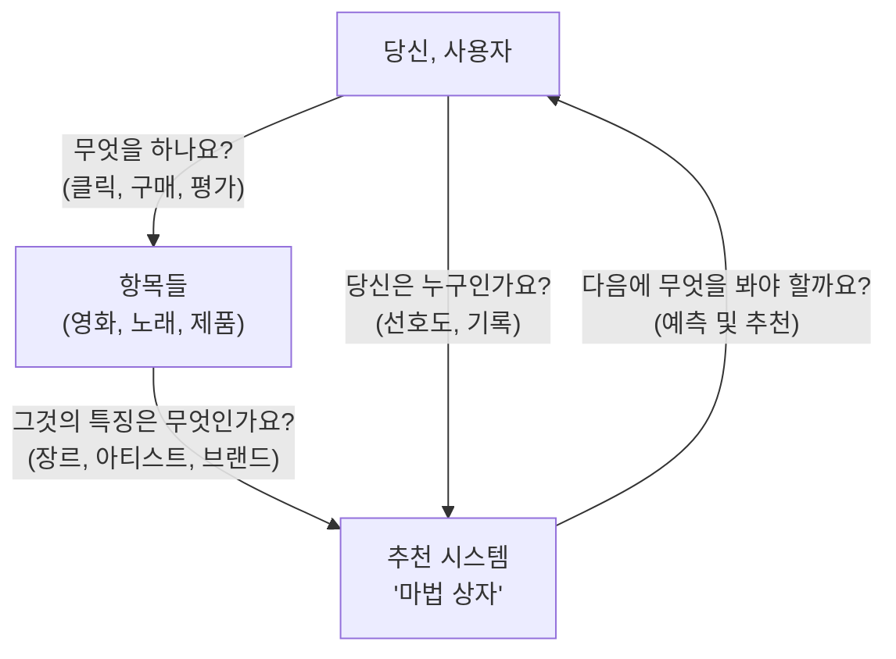

# 추천 시스템 학습 여정에 오신 것을 환영합니다!

친구들에게 새로운 노래를 추천하는 시스템을 만들고 싶다고 상상해보세요. 어디서부터 시작해야 할까요? 어떤 정보가 필요할까요? 그들이 무엇을 좋아할지 어떻게 알아낼 수 있을까요?

이 가이드는 이러한 질문들에 답하고 추천 시스템에 대한 견고한 이해를 구축하는 데 도움을 주기 위해 설계되었습니다. 우리는 배우는 가장 좋은 방법은 직접 해보고, 질문하고, 발견하는 것이라고 믿습니다. 따라서 개념에 대해 단순히 읽는 것 대신, 여러분은 다음과 같은 활동에 적극적으로 참여하게 될 것입니다:

*   다양한 유형의 추천 모델 **탐색**
*   실제 코드 예제로 **실험**
*   직관을 구축하기 위한 문제 **해결**
*   이러한 시스템이 어떻게 작동하는지 **시각화**

이것을 추천 시스템을 위한 여러분만의 실험실이라고 생각하세요!



구축을 시작할 준비가 되셨나요? 시작해봅시다!


## 1. 추천 시스템이란 무엇일까요? 첫 번째 탐색

자, 우리는 무언가를 추천하고 싶습니다. 하지만 "추천 시스템"이 실제로 *무엇을* 하는 걸까요? 핵심적으로, 그것은 누군가가 무엇을 좋아할지 예측하려고 합니다. 생각해보세요:

*   Netflix가 영화를 추천할 때, 그것은 당신이 그것을 즐길 것이라고 예측하는 것입니다.
*   Amazon이 "당신이 좋아할 만한 제품"을 보여줄 때, 그것은 당신의 관심사를 예측하는 것입니다.

기계가 이것을 어떻게 배울 수 있을까요? 관련된 부분들을 살펴보면서 시작해봅시다.



이 다이어그램은 기본적인 흐름을 보여줍니다. 하지만 "마법 상자"(우리의 시스템)가 작동하기 위해서는 정보가 필요합니다. 이 정보는 종종 "피드백"이라고 불립니다.

**몇 가지 핵심 아이디어를 살펴봅시다 (당신의 첫 번째 단서들!):**

*   **명시적 피드백 vs. 암시적 피드백:**
    *   **질문:** 사용자가 영화에 5점을 준다면, 그것은 직접적인 정보입니다. 그들이 단순히 끝까지 시청했다면 어떨까요? 그것도 유용할까요?
    *   **생각해보기:** 명시적 피드백은 명확합니다(예: 별점, 리뷰). 암시적 피드백은 더 탐정의 단서와 같습니다(예: 클릭, 조회수, 구매 기록). 왜 우리는 둘 다 필요할까요?

*   **"콜드 스타트" 퍼즐:**
    *   **질문:** 완전히 새로운 사용자가 가입하거나 완전히 새로운 영화가 추가되었다고 상상해보세요. 시스템이 그들에 대해 거의 아무것도 모른다면 어떻게 좋은 추천을 할 수 있을까요?
    *   **생각해보기:** 이것은 전형적인 도전 과제입니다! 새로운 사용자를 위해 어떤 간단한 추천을 할 수 있을까요? (힌트: 전체적으로 인기 있는 것은 무엇일까요?)

*   **희소성 도전 (많은 사용자, 많은 항목, 적은 연결):**
    *   **질문:** Netflix의 모든 영화를 생각해보세요. 한 사람이 실제로 평가하거나 시청한 영화는 몇 개일까요? 아마도 아주 작은 부분일 것입니다!
    *   **생각해보기:** 우리가 가진 데이터는 종종 대부분 빈 공간이 있는 거대한 격자처럼 보입니다. 이 "희소성"은 패턴을 찾는 것을 까다롭게 만듭니다. 이렇게 불완전한 정보로 어떻게 작업할 수 있을까요?

*   **크게 만들기 (확장성):**
    *   **질문:** 만약 당신의 시스템이 수백만 명의 사용자와 수백만 개의 항목을 가지고 있다면, 어떻게 빠르게 추천을 할 수 있을까요?
    *   **생각해보기:** 우리는 이러한 제안을 계산하고 전달하는 효율적인 방법이 필요합니다. 너무 느리다면 어떻게 될까요?

**"마법 상자"에 접근하는 일반적인 방법들:**

이것들에 대해 더 깊이 들어가겠지만, 여기 주요 전략들의 미리보기가 있습니다. 읽으면서, 다양한 종류의 추천을 위해 어떤 것이 가장 직관적으로 들리는지 생각해보세요:

*   **협업 필터링:**
    *   **아이디어:** "당신이 좋아한 것을 좋아한 사람들도 X를 좋아했습니다." 또는 "당신이 좋아한 것과 비슷한 항목들은 Y입니다."
    *   **생각해보기:** 공유된 취향을 기반으로 한 친구의 추천이 당신에게 효과가 있었던 적이 있나요?

*   **콘텐츠 기반 필터링:**
    *   **아이디어:** "당신은 우주선이 나오는 SF 영화를 좋아했습니다. 여기 더 많은 우주선이 나오는 SF 영화들이 있습니다."
    *   **생각해보기:** 항목의 특징이나 설명을 기반으로 특정한 것을 찾아본 적이 있나요?

*   **하이브리드 접근법:**
    *   **아이디어:** "두 세계의 장점을 결합해보자!"
    *   **생각해보기:** 위의 방법 중 하나만 사용하는 것이 충분하지 않을 수 있는 상황을 상상할 수 있나요?

이것은 우리의 탐색의 시작일 뿐입니다! 다음 섹션에서 이러한 아이디어들을 구축하고 테스트하기 시작할 것입니다.


## 2. 첫 번째 도구 모음: 기본 추천 전략

이제 추천 시스템이 무엇을 하는지 느낌을 알았으니, 몇 가지 기본적인 접근 방식으로 직접 해보겠습니다. 항목의 *콘텐츠*에 대해 많이 알지 못하지만, 사용자들이 그것들과 어떻게 상호작용했는지는 *알고* 있다면 어떻게 추천을 할 수 있을까요?

### 2.1. 군중의 힘: 협업 필터링 (CF)

새로운 영화를 찾으려고 한다고 상상해보세요. 취향이 비슷한 친구들에게 물어볼 수도 있겠죠? 또는 "영화 X"를 좋아했다면, "영화 X"를 좋아한 사람들도 즐긴 다른 영화들을 찾아볼 수도 있습니다. 이것이 협업 필터링의 핵심 아이디어입니다! 그것은 "군중의 지혜"를 사용합니다.

이것을 생각하는 두 가지 주요 방법이 있습니다:

#### 2.1.1. "취향 쌍둥이" 찾기: 사용자 기반 협업 필터링 (UBCF)

*   **도전 과제:** 사용자 A에게 무언가를 추천하고 싶다면, 과거에 사용자 A와 비슷한 것들을 좋아하고 싫어한 다른 사용자들을 찾을 수 있을까요? 그렇다면, 그 "취향 쌍둥이"들이 좋아했지만 사용자 A가 *아직* 보지 못한 것들이 좋은 추천이 될 수 있습니다!

*   **탐색 과정을 시각화해보겠습니다:**

    ```mermaid
    graph TD
        subgraph "사용자 기반 CF: 과정"
            U_Target[대상 사용자] --> Q1{"누가 비슷한 항목들을 좋아했나요?"};
            Q1 --> U_Similar1[비슷한 사용자 1];
            Q1 --> U_Similar2[비슷한 사용자 2];
            U_Similar1 --> I_LikedBySimilar1["항목 X
             (비슷한 사용자 1이 좋아함)"];
            U_Similar2 --> I_LikedBySimilar2["항목 Y
             (비슷한 사용자 2가 좋아함)"];
            I_LikedBySimilar1 --> PotentialRec1{항목 X를 추천할까요?};
            I_LikedBySimilar2 --> PotentialRec2{항목 Y를 추천할까요?};
            PotentialRec1 --> U_Target;
            PotentialRec2 --> U_Target;
        end
    ```

*   **당신의 미션 (수락하시겠습니까?):**
    1.  **코드 탐색:** 여기 예제를 살펴보세요: [`examples/collaborative_filtering/user_cf_example.py`](examples/collaborative_filtering/user_cf_example.py). 위의 다이어그램에 코드 로직을 매핑해보세요.
    2.  **생각해보기:**
        *   이 접근 방식이 잘 작동할 때는 언제일까요? (예: 비슷한 취향을 가진 많은 사용자들?)
        *   잠재적인 단점은 무엇일까요? (예: 사용자가 매우 독특한 취향을 가지고 있다면? 기록이 없는 새로운 사용자는 어떨까요 – 다시 "콜드 스타트" 문제!)
        *   예제는 아마도 유사도 측정(코사인 유사도나 피어슨 상관관계와 같은)을 사용할 것입니다. 이 측정을 바꿀 수 있다면 어떻게 될까요? 결과가 이 선택에 얼마나 민감할까요?

#### 2.1.2. "이 항목을 구매한 고객들은 다음도 구매했습니다...": 항목 기반 협업 필터링 (IBCF)

*   **도전 과제:** 비슷한 사용자를 찾는 대신, 비슷한 *항목*을 찾는 것은 어떨까요? 사용자가 "항목 A"를 좋아했고, "항목 A"를 좋아한 사람들이 자주 "항목 B"도 좋아했다면, 아마도 "항목 B"가 좋은 추천이 될 수 있습니다.

*   **항목 연결 시각화:**

    ```mermaid
    graph TD
        subgraph "항목 기반 CF: 과정"
            U_Current[사용자] -- 좋아함 --> I_Known["알려진 항목 (예: 사용자가 본 영화)"]
            I_Known --> Q2{"다른 어떤 항목들이 비슷한가요? (사용자 상호작용 패턴 기반)"}
            Q2 --> I_Similar1[비슷한 항목 1]
            Q2 --> I_Similar2[비슷한 항목 2]
            I_Similar1 --> Rec1{항목 1 추천}
            I_Similar2 --> Rec2{항목 2 추천}
            Rec1 --> U_Current
            Rec2 --> U_Current
        end
    ```

*   **당신의 미션:**
    1.  **코드 탐색:** 예제를 살펴보세요: [`examples/collaborative_filtering/item_cf_example.py`](examples/collaborative_filtering/item_cf_example.py). 두 항목이 "비슷한"지 어떻게 결정하는지 확인하세요.
    2.  **생각해보기:**
        *   이것이 사용자 기반 CF보다 더 나을 수 있는 때는 언제일까요? (힌트: 사용자 취향이 변하는 빈도와 항목 간 관계가 변하는 빈도를 생각해보세요).
        *   새로운 항목은 어떨까요? 이 접근 방식은 그것들을 어떻게 처리하나요?
        *   이것이 "X를 구매한 고객들은 Y도 구매했습니다" 또는 "X를 시청한 사람들은 Y도 시청했습니다"의 기반이 되는 것을 볼 수 있나요?

협업 필터링은 강력하지만 완벽하지는 않습니다. 큰 "군중"이 없거나 항목들이 매우 틈새적이라면 어떻게 될까요? 다른 방법들을 탐색해봅시다!


### 2.2. "이것을 좋아했다면, 이것도 좋아할 거예요!" - 콘텐츠 기반 필터링

좋습니다, "군중"을 사용하는 것은 한 가지 방법이지만, *항목*들 자체에 대해 많이 알고 있다면 어떨까요? 사용자가 키아누 리브스가 출연하는 액션 영화를 좋아한다면, 다른 사람들이 그것을 좋아했는지 여부와 관계없이 키아누 리브스가 출연하는 *다른* 액션 영화나 비슷한 플롯 스타일을 가진 다른 액션 영화를 좋아할 수도 있습니다! 이것이 콘텐츠 기반 필터링의 아이디어입니다.

*   **도전 과제:** 항목이 "무엇에 관한 것인지"를 어떻게 이해하고 그것을 사용자가 좋아하는 것과 일치시킬 수 있을까요?

*   **매칭 과정 시각화:**

    ```mermaid
    graph TD
        subgraph "콘텐츠 기반 필터링: 과정"
            U_Profile["사용자 프로필 무엇을 좋아했나요? 예: 'SF', '로봇' 선호"]
            I_New["새로운 항목 무엇에 관한 것인가요? 예: 'SF', '로봇', '우주 여행'이 나오는 영화"]

            U_Profile --> Q_Match{"이 항목의 콘텐츠가 사용자의 알려진 선호도와 일치하나요?"};
            I_New --> Q_Match;
            Q_Match -- 예 --> Recommend_It[새로운 항목 추천!];
            Q_Match -- 아니오 --> Dont_Recommend[이것은 아닐 것 같아요...];
        end
    ```

#### 2.2.1. 텍스트 사용하기: TF-IDF 기반 추천

항목의 "콘텐츠"를 표현하는 일반적인 방법 중 하나는, 특히 영화 줄거리, 기사 텍스트 또는 제품 상세 정보와 같은 텍스트 설명이 있는 경우, TF-IDF라는 기술을 사용하는 것입니다.

*   **핵심 아이디어 (단순화!):**
    *   **TF (용어 빈도):** 특정 단어가 항목의 설명에 얼마나 자주 나타나나요? "로봇"이라는 단어가 영화 요약에 여러 번 나타난다면, 그것은 아마도 그 영화에 중요할 것입니다.
    *   **IDF (역문서 빈도):** 그 단어가 *모든* 항목 설명에서 얼마나 흔한가요? "the"가 거의 모든 영화 요약에 나타난다면, 그것은 매우 특징적이지 않습니다. 하지만 "사이버펑크"가 몇 개의 요약에만 나타난다면, 그것은 그 특정 영화들에 대한 강한 신호입니다.
    *   **TF-IDF 점수:** 이것들을 결합하여 단어가 *모든* 항목의 맥락에서 *특정* 항목에 얼마나 중요한지에 대한 점수를 제공합니다.

*   **당신의 미션:**
    1.  **코드 탐색:** 예제를 확인하세요: [`examples/content_based/tfidf_example.py`](examples/content_based/tfidf_example.py). 텍스트 설명을 컴퓨터가 비교할 수 있는 수치적 특징으로 변환하는 방법을 보세요.
    2.  **생각해보기:**
        *   당신이 좋아하는 영화나 노래를 그것을 경험해본 적이 없는 사람에게 어떻게 설명하겠습니까? 어떤 키워드를 사용할까요? 그것이 TF-IDF와 어떻게 관련이 있나요?
        *   이 접근 방식의 장점은 무엇인가요? (힌트: 아직 아무도 평가하지 않았지만 설명이 있는 새로운 항목은 어떨까요? 이것은 "항목 콜드 스타트" 문제에 좋습니다!)
        *   한계점은 무엇인가요? (예: 설명이 나쁘다면? 당신이 이미 알고 있는 것과 매우 비슷한 것들만 추천받아 새로운 관심사 발견이 제한된다면 – 때로는 "필터 버블"이라고 불립니다.)
        *   특징 엔지니어링(어떤 "특징"이나 "콘텐츠"를 사용할지 결정하는 것)은 여기서 매우 중요합니다. 책을 추천한다면, 줄거리 요약 외에 어떤 다른 콘텐츠를 사용할 수 있을까요? (예: 저자, 장르, 출판 연도, 문학상?)

콘텐츠 기반 방법은 풍부한 항목 정보를 활용하는 데 좋습니다. 하지만 최고의 신호가 항목 설명이 아닌 사용자가 항목과 *상호작용*하는 방식에서 온다면 어떨까요? 패턴을 찾는 다른 방법을 살펴보겠습니다.


### 2.3. 숨겨진 연결 찾기: 행렬 분해

우리는 사용자 유사성과 항목 유사성을 살펴보았습니다. 하지만 관계가 더 복잡하다면 어떨까요? 사용자가 항목을 좋아하는 숨겨진(또는 "잠재적") 이유가 있다면 어떨까요? 예를 들어, 당신이 "영화 X"와 "영화 Y"를 좋아하는 이유는 그것들이 배우나 감독을 공유하기 때문(콘텐츠)이거나 같은 사람들이 그것들을 좋아했기 때문(협업)이 아니라, 그것들이 "기발한 유머 감각"과 "강한 여성 주인공"을 가지고 있기 때문일 수 있습니다 – 명시적으로 나열되지 않았지만 어딘가에 존재하는 특징들입니다.

행렬 분해 기술은 이러한 잠재적 요인들을 발견하려고 시도합니다.

*   **핵심 아이디어:** 사용자가 행이고 항목이 열이며 셀에 평가(또는 사용자가 항목과 상호작용했다면 1, 그렇지 않다면 0)가 포함된 큰 격자(행렬)가 있다고 상상해보세요. 이 행렬은 종종 매우 희소합니다(대부분 비어 있음). 행렬 분해는 이 큰 희소 행렬을 두 개의 더 작고 더 조밀한 행렬의 곱으로 근사하려고 시도합니다:
    1.  "사용자-요인" 행렬: 행은 사용자이고 열은 잠재적 요인입니다(예: 각 사용자가 "기발한 유머", "강한 여성 주인공" 등을 얼마나 좋아하는지).
    2.  "항목-요인" 행렬: 행은 잠재적 요인이고 열은 항목입니다(예: 각 항목이 "기발한 유머", "강한 여성 주인공" 등을 얼마나 가지고 있는지).

    이 더 작은 행렬들을 곱함으로써, 우리는 원래의 큰 행렬의 빈칸을 "채울" 수 있고 사용자가 아직 보지 못한 항목에 대한 평가를 예측할 수 있습니다!

    | 구성 요소 | 설명 | 예시 |
    |----------|------|------|
    | 원본 행렬 | 사용자-항목 상호작용 행렬 | 사용자별 영화 평점 행렬 |
    | 사용자-요인 행렬 | 사용자가 각 잠재 요인을 얼마나 선호하는지 | 사용자별 "액션", "로맨스", "코미디" 선호도 |
    | 항목-요인 행렬 | 각 항목이 각 잠재 요인을 얼마나 포함하는지 | 영화별 "액션", "로맨스", "코미디" 요소 |
    | 잠재 요인 | 명시적으로 정의되지 않은 숨겨진 특성 | "기발한 유머", "강한 여성 주인공" 등 |
    | 행렬 곱 | 두 행렬의 곱으로 원본 행렬 근사 | 사용자 선호도 × 항목 특성 = 예상 평점 |

    **장점:**
    * 희소한 데이터에서도 패턴 발견 가능
    * 잠재 요인을 통한 추천의 해석 가능성
    * 새로운 사용자/항목에 대한 일반화 능력

    **한계:**
    * 잠재 요인의 실제 의미 해석이 어려울 수 있음
    * 계산 비용이 높을 수 있음
    * 콜드 스타트 문제는 여전히 존재

*   **분해 과정 시각화:**

    ```mermaid
    graph TD
        subgraph "행렬 분해: 잠재적 요인 발견"
            UserItemMatrix["사용자-항목 상호작용 행렬
             (많은 빈 셀!)"] -->|"다음으로 근사..."| Factors{"두 개의 더 작은 행렬의 곱"}
            Factors --> UserFactors["사용자-잠재 요인 행렬
             (사용자 U가 요인 F를 얼마나 좋아하나요?)"]
            Factors --> ItemFactors["항목-잠재 요인 행렬
             (항목 I가 요인 F를 얼마나 가지고 있나요?)"]

            UserFactors --> Prediction["상호작용 예측!
             (사용자의 요인과 항목의 요인을 곱함)"]
            ItemFactors --> Prediction
        end
    ```

#### 2.3.1. 인기 있는 기술: 특이값 분해 (SVD)

이를 달성하는 일반적인 방법 중 하나는 SVD입니다. 전체 수학은 복잡할 수 있지만, 직관은 원래의 사용자-항목 상호작용 데이터의 최선의 저차원 근사를 찾는 것입니다.

*   **당신의 미션:**
    1.  **코드 탐색:** 이 예제를 살펴보세요: [`examples/matrix_factorization/svd_example.py`](examples/matrix_factorization/svd_example.py). 사용자-항목 데이터를 가져와 이러한 기본 요인들을 찾으려고 시도하는 코드를 보게 될 것입니다.
    2.  **생각해보기:**
        *   이 "잠재적 요인"들이 실제로 무엇을 나타낼 수 있을까요? 때로는 직관적인 장르나 특성에 해당하지만, 때로는 특징들의 더 추상적인 조합일 수 있습니다.
        *   이 접근 방식이 희소성을 어떻게 도울까요? (힌트: 사용자가 많은 항목을 평가하지 않았더라도, 우리가 몇 가지 잠재적 요인으로 그들을 설명할 수 있다면, 여전히 예측을 할 수 있습니다.)
        *   도전 과제는 무엇인가요? (예: 매우 큰 행렬의 경우 계산 집약적일 수 있습니다. 요인들이 항상 쉽게 해석될 수 있는 것은 아닙니다 – "요인 X"가 *의미하는* 것이 무엇일까요?)

이러한 기본 모델들은 많은 정교한 추천 시스템의 기반이 됩니다. 이제 딥러닝과 같은 더 고급 도구들을 가져오면 어떤 일이 일어나는지 살펴보겠습니다!


## 3. 파워 업: 고급 추천 전략

우리가 살펴본 기본 모델들은 강력하지만, 때로는 데이터의 패턴이 매우 복잡할 수 있습니다. 단순한 유사성이나 잠재 요인만으로는 충분하지 않을 때가 있죠. 이럴 때 더 발전된 기법, 특히 딥러닝을 활용한 방법들이 등장합니다. 이들은 방대한 데이터에서 미묘한 관계까지 학습할 수 있습니다.

### 3.1. 깊은 패턴 학습: 추천을 위한 딥러닝

딥러닝 모델, 흔히 신경망이라고 불리는 모델들은 여러 층의 "뉴런"을 통해 표현을 학습하고 예측을 만듭니다. 추천 분야에서 이들은 미묘한 신호까지 효과적으로 포착할 수 있습니다.

#### 3.1.1. 스마트 표현: 임베딩을 활용한 DNN(Deep Neural Networks)

딥러닝 추천에서 핵심 아이디어 중 하나는 "임베딩"입니다.

*   **도전 과제:** 사용자와 항목을 신경망이 이해할 수 있고, 그들의 중요한 특성을 담을 수 있는 방식으로 어떻게 표현할까요? 단순히 ID만 사용하면, 네트워크는 사용자나 항목 간의 관계를 알 수 없습니다.

*   **임베딩의 등장:** 임베딩은 본질적으로 사용자나 항목을 나타내는 학습된, 조밀한 벡터(숫자들의 리스트)입니다. 수작업으로 특징을 만드는 대신, 모델이 상호작용 데이터를 바탕으로 사용자와 항목을 가장 잘 표현하는 방법을 *학습*하게 합니다. 비슷한 취향의 사용자, 같은 사용자들이 자주 좋아하는 항목들은 비슷한 임베딩 벡터를 갖게 됩니다.

*   **DNN 과정 시각화:**

    ```mermaid
    graph TD
        subgraph "DNN 추천기: 임베딩으로 학습하기"
            U_Input["사용자 ID / 특징"] --> U_Embed["사용자 임베딩 층 Learns a dense vector for the user"]
            I_Input["항목 ID / 특징"] --> I_Embed["항목 임베딩 층 Learns a dense vector for the item"]

            U_Embed --> Network_Core["딥러닝 신경망 (Multiple Hidden Layers)"]
            I_Embed --> Network_Core

            Network_Core --> Processing{"Layers process and combine user & item embeddings, learning complex interactions"}
            Processing --> Output["출력층 Predicts interaction (e.g., rating, click probability)"]
        end
    ```

*   **당신의 미션:**
    1.  **코드 탐색:** 예제를 살펴보세요: [`examples/deep_learning/dnn_recommender.py`](examples/deep_learning/dnn_recommender.py). 임베딩이 어디서 생성되고, 네트워크에 어떻게 입력되는지 확인해보세요.
    2.  **생각해보기:**
        *   임베딩이 왜 강력할까요? (힌트: 사람이 직접 설계하지 못하는 유사성이나 관계까지 포착할 수 있습니다.)
        *   DNN은 매우 유연합니다. 임베딩 외에도 사용자 인구통계, 항목 카테고리 등 다양한 특징을 함께 입력할 수 있습니다. 이것이 추천 품질에 어떤 영향을 줄까요?
        *   잠재적인 단점은? (예: 많은 데이터가 필요, "블랙박스"라서 왜 추천했는지 해석이 어려움, 여전히 콜드 스타트 문제)
        *   네트워크의 층 수, 각 층의 뉴런 수는 어떻게 정할까요? 너무 단순하면? 너무 복잡하면?

딥러닝은 사용자 선호를 이해하는 데 많은 가능성을 열어줍니다. 다른 활용법도 살펴봅시다.

### 3.2. 다음은 무엇? 순차 추천 모델

여러분의 행동을 생각해보세요: 유튜브에서 연속으로 영상을 보거나, 스포티파이에서 노래를 들을 때, 순서가 중요할 때가 많죠. 지금 무엇을 봤는지가 다음에 무엇을 보고 싶은지에 큰 영향을 미칩니다. 순차 추천 모델은 이런 동적인 패턴을 포착하려고 합니다.

*   **도전 과제:** 사용자의 이전 상호작용 시퀀스를 바탕으로, 다음에 어떤 항목을 선택할지 어떻게 예측할 수 있을까요?

#### 3.2.1. 과거에 주목하기: SASRec(Self-Attentive Sequential Recommendation)

SASRec은 "Self-Attention"이라는 강력한 메커니즘(Transformer로 유명한 그 방식!)을 사용합니다.

*   **핵심 아이디어(단순화):** 사용자의 상호작용 시퀀스에서, self-attention은 과거의 어떤 항목이 다음 예측에 더 중요한지 가중치를 두어 학습합니다. 예를 들어, 방금 들은 노래가 다음 곡 예측에 더 중요할 수도 있고, 한참 전에 들었던 곡이 테마를 만들어 여전히 영향을 줄 수도 있습니다. Attention은 이런 부분을 파악하게 해줍니다!

*   **"다음은 무엇?" 게임 시각화:**

    ```mermaid
    graph LR
        subgraph "SASRec: 시퀀스에서 다음 항목 예측"
            PastInteractions["사용자의 과거 상호작용 (예: 항목 A -> 항목 B -> 항목 C)"] --> Model["SASRec 모델 Self-Attention으로 과거 항목 가중치 학습"]
            Model --> Q{"다음에 무엇이 나올까?"}
            Q --> PredictedNextItem["예측된 다음 항목 (예: 항목 D)"]
        end
    ```

*   **당신의 미션:**
    1.  **코드 탐색:** 예제를 확인하세요: [`examples/sequential/transformer_sasrec_example.py`](examples/sequential/transformer_sasrec_example.py). 시퀀스 데이터를 어떻게 처리하는지 살펴보세요.
    2.  **생각해보기:**
        *   언제 상호작용의 순서가 추천에 매우 중요할까요? (예: 음악 플레이리스트, 영상 시리즈, 튜토리얼 단계, 프로젝트별 구매 등)
        *   Self-attention은 시퀀스의 다양한 부분을 살펴보고, 다음 예측에 가장 중요한 부분을 스스로 결정합니다. 여러분의 경험에서, 세션 초반에 본 것이 나중에 큰 영향을 준 적이 있나요?
        *   도전 과제는? (예: 시퀀스가 매우 길어질 수 있음! 얼마나 긴 과거를 봐야 할까? 데이터가 많이 필요함)

순차 정보는 추천을 한층 더 개인화할 수 있게 해줍니다.

### 3.3. 두 세계의 장점: 하이브리드 추천 모델

우리는 협업 필터링(사용자-항목 상호작용 활용), 콘텐츠 기반 필터링(항목 특징 활용), 그리고 복잡한 패턴을 학습하는 딥러닝 모델을 살펴봤습니다. 이 아이디어들을 결합하면 어떨까요? 하이브리드 모델은 바로 그걸 목표로 합니다! 서로 다른 접근법의 장점을 살려 더 나은 추천을 만들고, 각 방법의 한계를 극복하려고 합니다.

#### 3.3.1. 분리되어 있지만 연결된 구조: 투타워(Two-Tower) 하이브리드 모델

매우 인기 있고 효과적인 하이브리드 구조 중 하나가 "투타워" 모델입니다.

*   **핵심 아이디어:** 두 개의 독립적인 신경망(타워)이 있다고 상상해보세요:
    1.  **사용자 타워:** 사용자에 대한 모든 정보(예: ID, 인구통계, 과거 상호작용, 시간대 등)를 입력받아, 그 사용자를 대표하는 임베딩을 학습합니다.
    2.  **항목 타워:** 항목에 대한 모든 정보(예: ID, 장르, 설명, 이미지 등)를 입력받아, 그 항목을 대표하는 임베딩을 학습합니다.

    두 임베딩을 결합하면(예: 내적, 코사인 유사도 등), 사용자가 해당 항목을 얼마나 좋아할지 예측할 수 있습니다.

*   **투타워 구조 시각화:**

    ```mermaid
    graph TD
        subgraph "투타워 모델: 사용자 & 항목 이해"
            direction LR
            subgraph "타워 1: 사용자 이해"
                U_Feat["사용자 특징 (ID, 활동, 인구통계)"] --> U_NN["사용자 신경망 (Processes user info)"] --> U_Embed["학습된 사용자 임베딩"]
            end

            subgraph "타워 2: 항목 이해"
                I_Feat["항목 특징 (ID, 설명, 카테고리)"] --> I_NN["항목 신경망 (Processes item info)"] --> I_Embed["학습된 항목 임베딩"]
            end

            U_Embed --> Combine{"결합 및 예측 How well does this User match with this Item?"}
            I_Embed --> Combine
            Combine --> Prediction["추천 점수"]
        end
    ```

*   **당신의 미션:**
    1.  **코드 탐색:** 예제를 확인하세요: [`examples/hybrid/two_tower_hybrid_example.py`](examples/hybrid/two_tower_hybrid_example.py). 사용자와 항목 각각의 네트워크 구조를 찾아보세요.
    2.  **생각해보기:**
        *   왜 이 구조가 "하이브리드"일까요? (힌트: 각 타워에 어떤 정보를 넣을 수 있을까요? 한쪽은 협업 신호, 한쪽은 콘텐츠 신호에 집중할 수도 있겠죠?)
        *   큰 장점 중 하나는 확장성입니다. 항목 임베딩을 미리 계산해두고, 사용자가 오면 사용자 임베딩만 계산해서 수백만 개 항목 중에서 빠르게 유사한 항목을 찾을 수 있습니다. 얼마나 효율적일지 상상해보세요!
        *   사용자 타워에는 어떤 특징을 넣을 수 있을까요? 항목 타워에는? 창의적으로 생각해보세요!
        *   임베딩을 단순 내적으로 결합하는 것과, 더 복잡한 상호작용 계층을 두는 것의 한계는 무엇일까요?

하이브리드 모델은 실제 서비스에서 매우 흔하게 쓰입니다. 유연성과 강력함 덕분이죠.

### 3.4. 연결된 세상의 추천: 그래프 기반 모델(GNN)

사용자와 항목이 어떻게 연결되어 있는지 생각해보세요. 사용자 A가 항목 1을 좋아합니다. 사용자 B도 항목 1과 2를 좋아합니다. 사용자 C는 항목 2를 좋아합니다. 이렇게 하면 관계의 네트워크, 즉 "그래프"가 만들어집니다! Graph Neural Network(GNN)는 이런 그래프 데이터를 직접 다루도록 설계된 모델입니다. 노드(사용자, 항목)가 어떻게 연결되어 있고, 이웃이 무엇을 하는지 살펴보며 학습합니다.

*   **핵심 아이디어:** 이런 풍부한 사용자-항목 상호작용 구조(그리고 다른 관계까지)를 어떻게 활용해 더 나은 추천을 만들 수 있을까요?

*   **그래프에서 학습하는 과정 시각화:**

    ```mermaid
    graph TD
        subgraph "GNN 추천: 연결에서 학습하기"
            direction LR
            U1["사용자 1"] -- Interacts --> I1["항목 1"]
            U1 -- Interacts --> I2["항목 2"]
            U2["사용자 2"] -- Interacts --> I1
            U2 -- Interacts --> I3["항목 3"]
            I1 -- Interacts --> U3["사용자 3"]

            U1 -- "GNN은 이웃(I1, I2)을 참고해 임베딩 학습" --> Emb_U1["사용자 1 임베딩"]
            I1 -- "GNN은 이웃(U1, U2, U3)을 참고해 임베딩 학습" --> Emb_I1["항목 1 임베딩"]

            Emb_U1 --> Rec_Engine["추천 엔진"]
            Emb_I1 --> Rec_Engine
            Rec_Engine --> Final_Rec["예측/추천"]
        end
    ```
    GNN은 그래프에서 노드의 지역적 이웃으로부터 정보를 "집계"하여 사용자와 항목의 표현(임베딩)을 학습합니다.

추천을 위해 적응된 다양한 GNN들이 있습니다:

#### 3.4.1. LightGCN: Keeping it Simple and Powerful

*   **핵심 아이디어(단순화):** LightGCN은 전통적인 GCN의 복잡성을 제거합니다. 사용자-항목 상호작용 그래프를 통해 임베딩을 선형적으로 전파하여 사용자와 항목 임베딩을 직접 학습하는 데 집중합니다. 노드의 임베딩을 이웃의 임베딩과 부드럽게 혼합하는 것이라고 생각하면 됩니다.
*   **코드 탐색:** [`examples/gnn/lightgcn_tf_example.py`](examples/gnn/lightgcn_tf_example.py)
*   **생각해보기:** 다른 GNN에서 흔히 볼 수 있는 비선형성과 특징 변환을 제거하는 것이 일부 추천 시나리오에서 실제로 *도움이* 될 수 있는 이유는 무엇일까요? (힌트: 단순함은 과적합을 방지하고 더 효율적일 수 있습니다).

#### 3.4.2. NGCF(Neural Graph Collaborative Filtering): 고차 신호 포착하기

*   **핵심 아이디어(단순화):** NGCF는 그래프의 "고차 연결성"을 명시적으로 모델링하려고 시도합니다. 이는 직접적인 이웃뿐만 아니라 이웃의 이웃, 그 이상까지 살펴보아 더 복잡한 협업 신호를 포착한다는 의미입니다.
*   **코드 탐색:** [`examples/gnn/ngcf_example.py`](examples/gnn/ngcf_example.py) (참고: 예제는 단순화되었을 수 있으며, 전체 세부사항은 종종 연구 논문에 있습니다.)
*   **생각해보기:** 추천을 위해 즉각적인 연결을 넘어서 보는 것이 가장 유익할 때는 언제일까요?

#### 3.4.3. PinSage: 웹 규모의 추천 (Pinterest에서 영감을 받음)

*   **핵심 아이디어(단순화):** Pinterest에서 개발된 PinSage는 대규모 그래프를 위해 설계되었습니다. 랜덤 워크를 사용하여 이웃을 샘플링하고, 중요도 풀링이 있는 그래프 컨볼루션을 사용하여 항목 임베딩을 생성합니다. 효율성과 확장성을 위해 구축되었습니다.
*   **코드 탐색:** [`examples/gnn/pinsage_example.py`](examples/gnn/pinsage_example.py)
*   **생각해보기:** Pinterest의 핀처럼 수십억 개의 항목이 있을 때 추천을 만드는 데 있어 고유한 도전 과제는 무엇일까요? 이웃을 "샘플링"하는 것이 어떻게 도움이 될까요?

#### 3.4.4. 추천을 위한 GCN (Graph Convolutional Network)

*   **핵심 아이디어(단순화):** 이것은 추천 문제에 대한 GCN의 더 일반적인 적용입니다. 다른 GCN과 마찬가지로, 노드의 이웃으로부터 특징 정보를 집계하여 노드 임베딩을 학습합니다.
*   **코드 탐색:** [`examples/gnn/gcn_example.py`](examples/gnn/gcn_example.py)
*   **생각해보기:** 표준 GCN이 LightGCN과 같은 추천 전용 GCN과 어떻게 다른가요? 트레이드오프는 무엇일까요?

#### 3.4.5. GraphSAGE: 그래프에서의 귀납적 학습

*   **핵심 아이디어(단순화):** GraphSAGE는 "귀납적" GNN입니다. 이는 학습 중에 *보지 못한* 노드(예: 새로운 사용자나 새로운 항목)에 대한 임베딩을 생성할 수 있는 함수를 학습한다는 의미입니다. 노드의 ID와 관계없이 노드의 지역적 이웃으로부터 특징을 집계하는 방법을 학습함으로써 이를 수행합니다.
*   **코드 탐색:** [`examples/gnn/graphsage_example.py`](examples/gnn/graphsage_example.py)
*   **생각해보기:** 동적 추천 시스템에서 *새로운* 사용자나 항목에 대한 임베딩을 생성할 수 있는 것(귀납적 능력)이 왜 큰 이점일까요?

#### 3.4.6. GAT (Graph Attention Network): 이웃의 중요도에 가중치 부여하기

*   **핵심 아이디어(단순화):** GAT는 그래프 컨볼루션에 "어텐션" 메커니즘을 도입합니다. 이를 통해 노드는 정보를 집계할 때 서로 다른 이웃에 대해 서로 다른 수준의 중요도를 할당할 수 있습니다. 모든 연결이 동일한 가치를 가지는 것은 아닙니다!
*   **코드 탐색:** [`examples/gnn/gat_example.py`](examples/gnn/gat_example.py)
*   **생각해보기:** 여러분의 연결 중 하나(예: 특정 친구의 의견이나 상호작용한 특정 항목)가 다른 것들보다 추천에 *더 큰* 영향을 미쳐야 하는 시나리오를 상상할 수 있나요? 그것이 어텐션이 도움이 되는 곳입니다.

GNN은 추천 분야에서 빠르게 진화하는 영역으로, 복잡한 관계를 모델링하는 강력한 방법을 제공합니다.


## 4. 이제 여러분의 차례: 추천 시스템을 위한 데이터 엔지니어링 챌린지

모델을 이해하는 것도 중요하지만, 실제로 작동하게 만들려면 데이터 엔지니어링이 필수입니다! 추천 시스템의 데이터 엔지니어가 된다면, 여러분은 데이터의 기반을 설계하는 건축가가 됩니다. 다음은 여러분이 데이터 엔지니어처럼 생각해볼 수 있는 몇 가지 챌린지입니다:

*   **챌린지 1: 데이터 탐정 – 사용자와 항목 이해하기**
    *   **과제:** 새로운 사용자 상호작용 데이터(예: 클릭, 구매, 평점)와 항목 메타데이터가 주어졌다고 상상해보세요.
    *   **탐색:**
        *   이 데이터에 대해 가장 먼저 어떤 질문을 해볼 수 있을까요?
        *   사용자 행동 패턴을 어떻게 이해할 수 있을까요? (예: 가장 인기 있는 항목은? 비슷한 행동을 보이는 사용자 그룹이 있는가?)
        *   항목의 특성은 어떻게 분석할 수 있을까요? (예: 어떤 특징이 있는가? 데이터가 깨끗하고 쓸모 있는가?)
        *   **간단한 다이어그램 그려보기(Mermaid!):** 데이터 소스와 각 소스에서 얻고 싶은 인사이트를 간단히 그려보세요.
        ```mermaid
        graph TD
            UserInteractions["사용자 상호작용 데이터 (클릭, 조회, 평점)"] --> Exploration1{"일반적인 사용자 경로는? 인기 항목은?"}
            ItemMetadata["항목 메타데이터 (장르, 브랜드, 설명)"] --> Exploration2{"핵심 항목 특징은? 카탈로그 다양성은?"}
            Exploration1 --> Insights["도출된 사용자 인사이트"]
            Exploration2 --> Insights2["도출된 항목 인사이트"]
            Insights & Insights2 --> SystemDesign["시스템 설계에 반영"]
        
        ```

*   **챌린지 2: 파이프라인 설계자 – 데이터 흐름 만들기**
    *   **과제:** 추천 모델을 지속적으로 학습하고 업데이트하는 데이터 파이프라인을 설계해야 합니다.
    *   **설계 질문:**
        *   원시 데이터는 어디서 올까요? (예: 스트리밍 이벤트, 배치 DB 덤프 등)
        *   모델에 맞게 데이터를 정제, 변환, 전처리하려면 어떤 단계가 필요할까요? (결측치 처리, 특징 엔지니어링 등)
        *   데이터와 모델을 어떻게 버전 관리할까요?
        *   학습된 모델을 어떻게 배포해 추천 서비스를 제공할까요?
    *   **다이어그램 그려보기:** 데이터 파이프라인의 상위 구조를 Mermaid로 그려보세요.

*   **챌린지 3: 특징 창조자 – 의미 있는 신호 만들기**
    *   **과제:** 현재 모델의 성능이 기대에 못 미칩니다. 더 나은 특징을 만들면 도움이 될 것 같습니다.
    *   **브레인스토밍:**
        *   사용자 상호작용 데이터로 어떤 새로운 사용자 특징을 만들 수 있을까요? (예: 선호 장르, 세션당 평균 체류 시간, 최근 방문 시점 등)
        *   항목 데이터로 어떤 새로운 항목 특징을 만들 수 있을까요? (예: 항목 인기 점수, 설명의 텍스트 임베딩, 계절성 특징 등)
        *   새로 만든 특징이 실제로 모델 성능을 개선하는지 어떻게 검증할 수 있을까요?

*   **챌린지 4: 품질 검사관 – 추천 시스템 평가하기**
    *   **과제:** 새로운 추천 모델을 만들었습니다. 이게 정말 좋은지 어떻게 알 수 있을까요?
    *   **평가 계획:**
        *   성공을 측정하는 다양한 방법은 무엇일까요? (정확도 외에도 다양성, 우연성, 참신함 등)
        *   오프라인 평가 지표(예: Precision@K, Recall@K, NDCG, MAE, RMSE)는 무엇이고, 각각이 의미하는 바와 한계는?
        *   오프라인 평가와 온라인 A/B 테스트의 차이는? 왜 둘 다 중요할까요?
        *   새로운 추천 시스템을 위한 A/B 테스트를 어떻게 설계할까요? 무엇을 측정할까요?

*   **챌린지 5: 효율성 전문가 – 성장에 맞춰 확장하기**
    *   **과제:** 추천 시스템이 매우 인기를 끌고 있습니다! 이제 수백만 명의 사용자와 수백만 개의 항목이 있고, 매우 빠르게 추천을 생성해야 합니다.
    *   **최적화 전략:**
        *   시스템의 병목은 어디에서 발생할까요? (데이터 처리, 모델 학습, 예측 서비스 등)
        *   후보군 생성 속도를 높이기 위해 어떤 기법을 쓸 수 있을까요? (예: 임베딩을 활용한 근사 최근접 이웃 검색)
        *   시스템이 견고하고 장애에 강하도록 하려면 어떻게 해야 할까요?

*   **챌린지 6: 평생 학습자 – 최신 동향 따라잡기**
    *   **과제:** 추천 시스템 분야는 매우 빠르게 변합니다!
    *   **학습 계획:**
        *   새로운 논문, 업계 베스트 프랙티스, 새로운 도구를 어떻게 따라잡을까요?
        *   최근 AI나 머신러닝에서 추천 시스템에 적용할 만한 발전이 무엇이 있을까요?

이 챌린지들은 시작점에 불과합니다. 추천 시스템 데이터 엔지니어의 여정은 끊임없는 학습, 문제 해결, 그리고 구축의 연속입니다. 이 학습 경로가 여러분께 지도를 주고 도구를 제공했다면, 이제는 여러분이 직접 이 세계를 탐험할 차례입니다!
