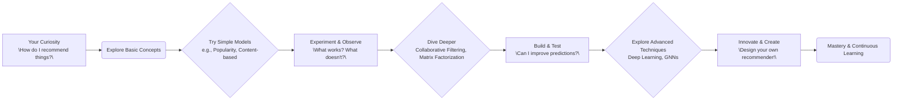
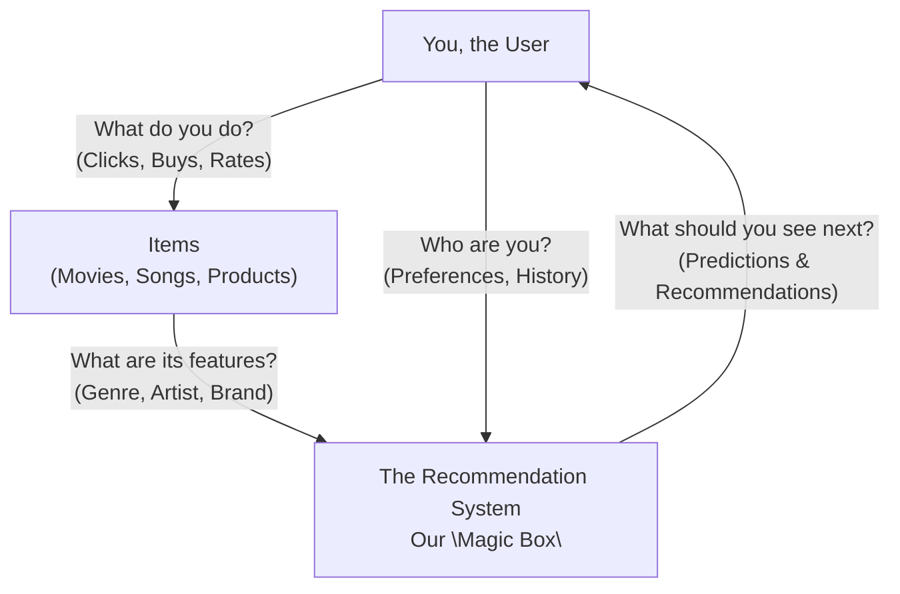

# Welcome to Your Recommendation System Learning Journey!

Imagine you want to build a system that suggests new songs to your friends. Where would you even begin? What information would you need? How would you figure out what they might like?

This guide is designed to help you answer these kinds of questions and build a solid understanding of recommendation systems. We believe the best way to learn is by doing, questioning, and discovering. So, instead of just reading about concepts, you'll be actively involved in:

*   **Exploring** different types of recommendation models.
*   **Experimenting** with real code examples.
*   **Solving** problems to build your intuition.
*   **Visualizing** how these systems work.

Think of this as your personal lab for recommendation systems!



Ready to start building? Let's go!


## 1. What ARE Recommendation Systems, Anyway? Your First Exploration

So, we want to recommend things. But what does a "recommendation system" actually *do*? At its heart, it's trying to predict what someone will like. Think about it:

*   When Netflix suggests a movie, it's predicting you'll enjoy it.
*   When Amazon shows you "products you might like," it's predicting your interest.

How can a machine learn to do this? Let's start by looking at the pieces involved.



This diagram shows the basic flow. But the "Magic Box" (our system) needs information to work with. This information is often called "feedback."

**Let's Unpack Some Key Ideas (Your First Clues!):**

*   **Explicit Feedback vs. Implicit Feedback:**
    *   **Question:** If a user rates a movie 5 stars, that's direct information. What if they just watch it all the way through? Is that also useful?
    *   **Think:** Explicit feedback is clear (e.g., star ratings, reviews). Implicit feedback is more like a detective's clue (e.g., clicks, views, purchase history). Why might we need both?

*   **The "Cold Start" Puzzle:**
    *   **Question:** Imagine a brand new user signs up, or a completely new movie is added. How can the system make good recommendations if it knows almost nothing about them?
    *   **Think:** This is a classic challenge! What simple recommendations could you make for a new user? (Hint: What's popular overall?)

*   **The Sparsity Challenge (Lots of Users, Lots of Items, Few Connections):**
    *   **Question:** Think about all the movies on Netflix. How many has one person actually rated or watched? Probably a tiny fraction!
    *   **Think:** The data we have often looks like a giant grid with mostly empty spaces. This "sparsity" makes it tricky to find patterns. How can we work with such incomplete information?

*   **Making it BIG (Scalability):**
    *   **Question:** If your system has millions of users and millions of items, how can it make recommendations quickly?
    *   **Think:** We need efficient ways to calculate and deliver these suggestions. What happens if it's too slow?

**Common Ways to Approach the "Magic Box":**

We'll dive into these much deeper, but here's a sneak peek at the main strategies. As you read, think about which one sounds most intuitive to you for different kinds of recommendations:

*   **Collaborative Filtering:**
    *   **Idea:** "People who liked what you liked, also liked X." Or, "Items similar to what you liked are Y."
    *   **Think:** When has a friend's recommendation (based on shared tastes) worked for you?

*   **Content-Based Filtering:**
    *   **Idea:** "You liked sci-fi movies with spaceships. Here are more sci-fi movies with spaceships."
    *   **Think:** When do you look for something specific based on its features or description?

*   **Hybrid Approaches:**
    *   **Idea:** "Let's combine the best of both worlds!"
    *   **Think:** Can you imagine situations where using just one of the above methods might not be enough?

This is just the beginning of our exploration! In the next sections, we'll start building and testing some of these ideas.


## 2. Your First Toolkit: Basic Recommendation Strategies

Now that we have a feel for what recommendation systems do, let's get our hands dirty with some fundamental approaches. How can we make recommendations if we don't know much about the *content* of the items, but we *do* know how users have interacted with them?

### 2.1. The Power of Crowds: Collaborative Filtering (CF)

Imagine you're trying to find a new movie. You might ask friends who have similar tastes, right? Or, if you loved "Movie X," you might look for other movies that people who loved "Movie X" also enjoyed. This is the core idea of Collaborative Filtering! It uses the "wisdom of the crowd."

There are two main ways to think about this:

#### 2.1.1. Finding Your "Taste Twins": User-Based Collaborative Filtering (UBCF)

*   **The Challenge:** If you want to recommend something to User A, can you find other users who have liked and disliked similar things to User A in the past? If so, maybe the things those "taste twins" liked, but User A *hasn't* seen yet, would be good recommendations!

*   **Let's Visualize the Hunt:**

    ```mermaid
    graph TD
        subgraph "User-Based CF: The Process"
            U_Target[Target User] --> Q1{"Who liked similar items?"};
            Q1 --> U_Similar1[Similar User 1];
            Q1 --> U_Similar2[Similar User 2];
            U_Similar1 --> I_LikedBySimilar1["Item X\n(Liked by Similar User 1)"];
            U_Similar2 --> I_LikedBySimilar2["Item Y\n(Liked by Similar User 2)"];
            I_LikedBySimilar1 --> PotentialRec1{Recommend Item X?};
            I_LikedBySimilar2 --> PotentialRec2{Recommend Item Y?};
            PotentialRec1 --> U_Target;
            PotentialRec2 --> U_Target;
        end
    ```

*   **Your Mission (Should You Choose to Accept It):**
    1.  **Explore the Code:** Take a look at the example here: [`examples/collaborative_filtering/user_cf_example.py`](examples/collaborative_filtering/user_cf_example.py). Try to map the code logic to the diagram above.
    2.  **Think About It:**
        *   When would this approach work well? (e.g., lots of users with overlapping tastes?)
        *   What are the potential downsides? (e.g., what if a user has very unique tastes? What about new users with no history – the "cold start" problem again!)
        *   The example likely uses a similarity measure (like cosine similarity or Pearson correlation). What do you think would happen if you could swap this measure? How sensitive is the outcome to this choice?

#### 2.1.2. "Customers Who Bought This Item Also Bought...": Item-Based Collaborative Filtering (IBCF)

*   **The Challenge:** Instead of finding similar users, what if we find similar *items*? If a user liked "Item A," and "Item B" is frequently liked by people who liked "Item A," then maybe "Item B" is a good recommendation.

*   **Visualizing Item Connections:**

    ```mermaid
    graph TD
        subgraph "Item-Based CF: The Process"
            U_Current[User] -- Liked --> I_Known["Known Item\n(e.g., Movie User Watched)"]
            I_Known --> Q2{"What other items are similar\n(based on user interaction patterns)?"}
            Q2 --> I_Similar1[Similar Item 1]
            Q2 --> I_Similar2[Similar Item 2]
            I_Similar1 --> Rec1{Recommend Item 1}
            I_Similar2 --> Rec2{Recommend Item 2}
            Rec1 --> U_Current
            Rec2 --> U_Current
        end
    ```

*   **Your Mission:**
    1.  **Explore the Code:** Dive into the example: [`examples/collaborative_filtering/item_cf_example.py`](examples/collaborative_filtering/item_cf_example.py). How does it determine if two items are "similar"?
    2.  **Think About It:**
        *   When might this be better than User-Based CF? (Hint: Think about how often user tastes change versus how often item-to-item relationships change).
        *   What about new items? How does this approach handle them?
        *   Can you see how this is the backbone of "Customers who bought X also bought Y" or "People who watched X also watched Y"?

Collaborative Filtering is powerful, but it's not perfect. What happens if you don't have a large "crowd" or if your items are very niche? Let's explore other ways!


### 2.2. "If You Liked That, You'll Love This!" - Content-Based Filtering

Okay, using the "crowd" is one way, but what if you know a lot about the *items* themselves? If a user loves action movies starring Keanu Reeves, maybe they'd like *other* action movies with Keanu Reeves, or even other action movies with a similar plot style, regardless of who else liked them! This is the idea behind Content-Based Filtering.

*   **The Challenge:** How can we understand what an item is "about" and match that to what a user likes?

*   **Visualizing the Matchmaking:**

    ```mermaid
    graph TD
        subgraph "Content-Based Filtering: The Process"
            U_Profile["User Profile\nWhat have they liked?\ne.g., Prefers 'Sci-Fi', 'Robots'"]
            I_New["New Item\nWhat is it about?\ne.g., Movie with 'Sci-Fi', 'Robots', 'Space Travel'"]

            U_Profile --> Q_Match{"Does this item's content\nmatch the user's known preferences?"};
            I_New --> Q_Match;
            Q_Match -- Yes --> Recommend_It[Recommend New Item!];
            Q_Match -- No --> Dont_Recommend[Maybe Not This One...];
        end
    ```

#### 2.2.1. Using Text: TF-IDF Based Recommendations

One common way to represent the "content" of items, especially if they have text descriptions (like movie plots, article text, or product details), is a technique called TF-IDF.

*   **The Core Idea (Simplified!):**
    *   **TF (Term Frequency):** How often does a specific word appear in an item's description? If "robot" appears many times in a movie summary, it's probably important for that movie.
    *   **IDF (Inverse Document Frequency):** How common is that word across *all* item descriptions? If "the" appears in almost every movie summary, it's not very distinctive. But if "cyberpunk" appears in only a few, it's a strong signal for those specific movies.
    *   **TF-IDF Score:** Combines these to give a score for how important a word is to a *specific* item, in the context of *all* items.

*   **Your Mission:**
    1.  **Explore the Code:** Check out the example: [`examples/content_based/tfidf_example.py`](examples/content_based/tfidf_example.py). See how it might convert text descriptions into numerical features that a computer can compare.
    2.  **Think About It:**
        *   How would you describe your favorite movie or song to someone who's never experienced it? What keywords would you use? How does that relate to TF-IDF?
        *   What are the benefits of this approach? (Hint: What about new items that no one has rated yet, but have descriptions? This is great for the "item cold start" problem!)
        *   What are the limitations? (e.g., What if the descriptions are bad? What if you *only* get recommendations for things very similar to what you already know, limiting discovery of new interests – sometimes called the "filter bubble".)
        *   Feature engineering (deciding what "features" or "content" to use) is super important here. If you were recommending books, besides plot summaries, what other content could you use? (e.g., author, genre, publication year, writing awards?)

Content-based methods are great for leveraging rich item information. But what if the best signals come from how users *interact* with items, rather than just the item descriptions? Let's look at another way to find patterns.


### 2.3. Finding Hidden Connections: Matrix Factorization

We've looked at user similarity and item similarity. But what if the relationships are more complex? What if there are hidden (or "latent") reasons why a user likes an item? For example, you might like "Movie X" and "Movie Y" not because they share actors or directors (content), or because the same people liked them (collaborative), but because they both have a "quirky sense of humor" and "strong female leads" – features that aren't explicitly listed but are somehow present.

Matrix Factorization techniques try to uncover these latent factors.

*   **The Core Idea:** Imagine you have a big grid (a matrix) where rows are users, columns are items, and the cells contain ratings (or 1 if a user interacted with an item, 0 if not). This matrix is often very sparse (mostly empty). Matrix Factorization tries to approximate this big sparse matrix as a product of two smaller, denser matrices:
    1.  A "user-factor" matrix: Rows are users, columns are latent factors (e.g., how much each user likes "quirky humor," "strong female leads," etc.).
    2.  An "item-factor" matrix: Rows are latent factors, columns are items (e.g., how much each item possesses "quirky humor," "strong female leads," etc.).

    By multiplying these smaller matrices, we can "fill in" the blanks in the original big matrix and predict ratings for items a user hasn't seen!

*   **Visualizing the Decomposition:**

    ```mermaid
    graph TD
        subgraph "Matrix Factorization: Uncovering Latent Factors"
            UserItemMatrix["User-Item Interaction Matrix\n(Many empty cells!)"] -->|"Approximate with..."| Factors{"Product of Two Smaller Matrices"}
            Factors --> UserFactors["User-Latent Factor Matrix\n(How much User U likes Factor F?)"]
            Factors --> ItemFactors["Item-Latent Factor Matrix\n(How much Item I has Factor F?)"]

            UserFactors --> Prediction["Predict Interaction!\n(Multiply User's factors with Item's factors)"]
            ItemFactors --> Prediction
        end
    ```

#### 2.3.1. A Popular Technique: Singular Value Decomposition (SVD)

One common method to achieve this is SVD. While the full mathematics can be complex, the intuition is about finding the best lower-dimensional approximation of our original user-item interaction data.

*   **Your Mission:**
    1.  **Explore the Code:** Take a peek at this example: [`examples/matrix_factorization/svd_example.py`](examples/matrix_factorization/svd_example.py). You'll see code that takes user-item data and tries to find these underlying factors.
    2.  **Think About It:**
        *   What could these "latent factors" actually represent? Sometimes they correspond to intuitive genres or characteristics, but sometimes they are more abstract combinations of features.
        *   How does this approach help with sparsity? (Hint: Even if a user hasn't rated many items, if we can describe them by a few latent factors, we can still make predictions.)
        *   What are the challenges? (e.g., It can be computationally intensive for very large matrices. The factors might not always be easily interpretable – what does "Factor X" *mean*?)

These basic models are the building blocks for many sophisticated recommendation systems. Now, let's see what happens when we bring in more advanced tools like deep learning!


## 3. Powering Up: Advanced Recommendation Strategies

The basic models we've explored are powerful, but sometimes the patterns in data are incredibly complex. What if simple similarities or latent factors aren't enough? This is where more advanced techniques, especially those using Deep Learning, come into play. They can learn intricate relationships from vast amounts of data.

### 3.1. Learning the Deep Patterns: Deep Learning for Recommendations

Deep learning models, often called neural networks, use layers of interconnected "neurons" to learn representations and make predictions. For recommendations, they can be very effective at capturing subtle signals.

#### 3.1.1. Smart Representations: Deep Neural Networks (DNNs) with Embeddings

One of the key ideas in using DNNs for recommendations is "embeddings."

*   **The Challenge:** We have users and items. How do we represent them in a way that a neural network can understand and that captures their important characteristics? We could use raw IDs, but that doesn't tell the network anything about how users or items relate to each other.

*   **Embeddings to the Rescue:** An embedding is essentially a learned, dense vector (a list of numbers) that represents a user or an item. Instead of starting with hand-crafted features, we let the model *learn* the best way to represent users and items based on the interaction data. Users with similar tastes, or items that are often liked by the same users, will end up with similar embedding vectors.

*   **Visualizing the DNN Process:**

    ```mermaid
    graph TD
        subgraph "DNN Recommender: Learning with Embeddings"
            U_Input["User ID / Features"] --> U_Embed["User Embedding Layer\nLearns a dense vector for the user"]
            I_Input["Item ID / Features"] --> I_Embed["Item Embedding Layer\nLearns a dense vector for the item"]

            U_Embed --> Network_Core["Deep Neural Network\n(Multiple Hidden Layers)"]
            I_Embed --> Network_Core

            Network_Core --> Processing{"Layers process and combine\nuser & item embeddings,\nlearning complex interactions"}
            Processing --> Output["Output Layer\nPredicts interaction\n(e.g., rating, click probability)"]
        end
    ```

*   **Your Mission:**
    1.  **Explore the Code:** Dive into the example: [`examples/deep_learning/dnn_recommender.py`](examples/deep_learning/dnn_recommender.py). Try to identify where the embeddings are created and how they are fed into the network.
    2.  **Think About It:**
        *   Why are learned embeddings powerful? (Hint: They can capture similarities and relationships that you might not have thought to encode manually.)
        *   DNNs are very flexible. You can add other features (like user demographics or item categories) into the network along with the embeddings. How might this improve recommendations?
        *   What are the potential downsides? (e.g., They often require a lot of data to train effectively. They can be "black boxes" – it's sometimes hard to understand *why* the network made a particular recommendation. The "cold start" problem can still be an issue.)
        *   How many layers should the network have? How many neurons in each layer? These are design choices! What might happen if the network is too simple? Too complex?

Deep learning opens up many possibilities for understanding user preferences. Let's look at other ways it's applied.


### 3.2. What's Next? Sequential Recommendation Models

Think about your own behavior: when you watch a series of videos on YouTube, or listen to songs on Spotify, the order often matters. What you watch or listen to *now* can heavily influence what you want *next*. Sequential recommendation models try to capture this dynamic.

*   **The Challenge:** How can we predict the next item a user might interact with, given the sequence of their previous interactions?

#### 3.2.1. Paying Attention to the Past: SASRec (Self-Attentive Sequential Recommendation)

SASRec is a model that uses a powerful mechanism called "self-attention" (you might have heard of it from Transformers, which are famous in language models like GPT).

*   **The Core Idea (Simplified):** For a given sequence of items a user has interacted with, the self-attention mechanism helps the model weigh the importance of different items in the past when predicting the *next* item. For example, if you're listening to a playlist, the song you listened to 30 seconds ago might be more important for predicting the next song than the one you listened to an hour ago. Or, perhaps an item further back in the sequence started a "theme" that's still relevant. Attention helps figure this out!

*   **Visualizing the "What's Next?" Game:**

    ```mermaid
    graph LR
        subgraph "SASRec: Predicting the Next Item in a Sequence"
            PastInteractions["User's Past Interactions\n(e.g., Item A -> Item B -> Item C)"] --> Model["SASRec Model\n(Uses Self-Attention to weigh past items)"]
            Model --> Q{"What's likely to be next?"}
            Q --> PredictedNextItem["Predicted Next Item\n(e.g., Item D)"]
        end
    ```

*   **Your Mission:**
    1.  **Explore the Code:** Check out the example: [`examples/sequential/transformer_sasrec_example.py`](examples/sequential/transformer_sasrec_example.py). This is a more complex model, but try to see how it processes a sequence of interactions.
    2.  **Think About It:**
        *   When is the order of interactions super important for recommendations? (e.g., music playlists, video series, steps in a tutorial, products bought in a project). When might it be less important?
        *   Self-attention allows the model to look at different parts of the sequence and decide which parts are most relevant for the next prediction. Can you think of an example from your own experience where something you saw or did earlier in a session strongly influenced what you wanted next?
        *   What are the challenges? (e.g., Sequences can get very long! How much history do we need? These models can also be data-hungry.)

Understanding sequences adds another layer to how we can personalize recommendations.


### 3.3. The Best of Both Worlds: Hybrid Recommendation Models

We've seen collaborative filtering (uses user-item interactions), content-based filtering (uses item features), and deep learning models that can learn complex patterns. What if we could combine these ideas? That's what hybrid models aim to do! They try to leverage the strengths of different approaches to make even better recommendations and overcome some of the individual limitations.

#### 3.3.1. Separate But Connected: The Two-Tower Hybrid Model

A very popular and effective hybrid architecture is the "Two-Tower" model.

*   **The Core Idea:** Imagine you have two separate neural networks (the "towers"):
    1.  **User Tower:** This network takes all sorts of information about the *user* (e.g., user ID, demographics, past interactions, context like time of day) and learns a compact representation (an embedding) for that user.
    2.  **Item Tower:** This network takes all sorts of information about the *item* (e.g., item ID, genre, product description, image) and learns a compact representation (an embedding) for that item.

    The magic happens when you bring these two embeddings together. You can calculate their similarity (e.g., using a dot product or cosine similarity) to predict how much the user would like that item.

*   **Visualizing the Towers:**

    ```mermaid
    graph TD
        subgraph "Two-Tower Model: User & Item Understanding"
            direction LR
            subgraph "Tower 1: User Understanding"
                U_Feat["User Features\n(ID, activity, demographics)"] --> U_NN["User Neural Network\n(Processes user info)"] --> U_Embed["Learned User Embedding"]
            end

            subgraph "Tower 2: Item Understanding"
                I_Feat["Item Features\n(ID, description, category)"] --> I_NN["Item Neural Network\n(Processes item info)"] --> I_Embed["Learned Item Embedding"]
            end

            U_Embed --> Combine{"Combine & Predict\nHow well does this User\nmatch with this Item?"}
            I_Embed --> Combine
            Combine --> Prediction["Recommendation Score"]
        end
    ```

*   **Your Mission:**
    1.  **Explore the Code:** Check out the example: [`examples/hybrid/two_tower_hybrid_example.py`](examples/hybrid/two_tower_hybrid_example.py). Try to identify the two separate network structures for users and items.
    2.  **Think About It:**
        *   Why is this a "hybrid" approach? (Hint: What kind of information can go into each tower? Could one tower focus more on collaborative signals and the other on content signals?)
        *   One big advantage is scalability, especially for retrieving candidates. Once you've trained the item tower, you can pre-compute all the item embeddings. Then, when a user comes, you compute their user embedding and can quickly find the most similar item embeddings from millions of items. Can you see how this would be efficient?
        *   What kind of features would you feed into the user tower? What about the item tower? Get creative!
        *   When the user and item embeddings are combined (often by a simple dot product), the model is learning what makes a "good match." What are the limitations of combining them this way, versus a more complex interaction layer?

Hybrid models are very common in real-world systems because of their flexibility and power.


### 3.4. Recommendations in a Connected World: Graph-Based Models (GNNs)

Think about how users and items are connected. User A likes Item 1. User B also likes Item 1 and Item 2. User C likes Item 2. This forms a network, or a "graph," of relationships! Graph Neural Networks (GNNs) are designed to work directly with this kind of graph data. They learn by looking at how nodes (users and items) are connected and what their neighbors are doing.

*   **The Challenge:** How can we leverage the rich structure of these user-item interactions (and potentially other relationships) to make better recommendations?

*   **Visualizing Learning on a Graph:**

    ```mermaid
    graph TD
        subgraph "GNN Recommendation: Learning from Connections"
            direction LR
            U1["User 1"] -- Interacts --> I1["Item 1"]
            U1 -- Interacts --> I2["Item 2"]
            U2["User 2"] -- Interacts --> I1
            U2 -- Interacts --> I3["Item 3"]
            I1 -- Interacts --> U3["User 3"]

            U1 -- "GNN Learns Embedding\nby looking at U1's\nneighborhood (I1, I2)" --> Emb_U1["User 1 Embedding"]
            I1 -- "GNN Learns Embedding\nby looking at I1's\nneighborhood (U1, U2, U3)" --> Emb_I1["Item 1 Embedding"]

            Emb_U1 --> Rec_Engine["Recommendation Engine"]
            Emb_I1 --> Rec_Engine
            Rec_Engine --> Final_Rec["Predict/Recommend"]
        end
    ```
    The GNN learns representations (embeddings) for users and items by "aggregating" information from their local neighborhoods in the graph.

There are many flavors of GNNs adapted for recommendations. Let's explore a few:

#### 3.4.1. LightGCN: Keeping it Simple and Powerful

*   **Core Idea (Simplified):** LightGCN strips down the complexity of traditional GCNs. It focuses on directly learning user and item embeddings by linearly propagating them through the user-item interaction graph. Think of it as smoothly blending the embeddings of a node with those of its neighbors.
*   **Explore the Code:** [`examples/gnn/lightgcn_tf_example.py`](examples/gnn/lightgcn_tf_example.py)
*   **Think:** Why might removing non-linearities and feature transformations (common in other GNNs) actually *help* in some recommendation scenarios? (Hint: Simplicity can prevent overfitting and be more efficient).

#### 3.4.2. NGCF (Neural Graph Collaborative Filtering): Capturing Higher-Order Signals

*   **Core Idea (Simplified):** NGCF explicitly tries to model "high-order connectivity" in the graph. This means it's not just looking at direct neighbors, but also neighbors of neighbors, and so on, to capture more complex collaborative signals.
*   **Explore the Code:** [`examples/gnn/ngcf_example.py`](examples/gnn/ngcf_example.py) (Note: Examples might be simplified; full details are often in research papers.)
*   **Think:** When would looking beyond immediate connections be most beneficial for recommendations?

#### 3.4.3. PinSage: Recommendations at Web Scale (Inspired by Pinterest)

*   **Core Idea (Simplified):** Developed by Pinterest, PinSage is designed for massive graphs. It uses techniques like random walks to sample neighborhoods and graph convolutions with importance pooling to generate item embeddings. It's built for efficiency and scale.
*   **Explore the Code:** [`examples/gnn/pinsage_example.py`](examples/gnn/pinsage_example.py)
*   **Think:** What are the unique challenges of making recommendations when you have billions of items (like pins on Pinterest)? How does "sampling" neighbors help?

#### 3.4.4. GCN (Graph Convolutional Network) for Recommendations

*   **Core Idea (Simplified):** This is a more general application of GCNs to the recommendation problem. Like other GCNs, it learns node embeddings by aggregating feature information from their neighbors.
*   **Explore the Code:** [`examples/gnn/gcn_example.py`](examples/gnn/gcn_example.py)
*   **Think:** How is a standard GCN different from a specialized one like LightGCN for recommendations? What are the trade-offs?

#### 3.4.5. GraphSAGE: Inductive Learning on Graphs

*   **Core Idea (Simplified):** GraphSAGE is an "inductive" GNN. This means it learns a function that can generate embeddings for nodes it *hasn't seen* during training (e.g., new users or new items). It does this by learning how to aggregate features from a node's local neighborhood, regardless of the node's identity.
*   **Explore the Code:** [`examples/gnn/graphsage_example.py`](examples/gnn/graphsage_example.py)
*   **Think:** Why is being able to generate embeddings for *new* users or items (inductive capability) a huge advantage in dynamic recommendation systems?

#### 3.4.6. GAT (Graph Attention Network): Weighing Neighbors' Importance

*   **Core Idea (Simplified):** GAT introduces an "attention" mechanism into the graph convolution. This allows a node to assign different levels of importance to its different neighbors when aggregating information. Not all connections are equally valuable!
*   **Explore the Code:** [`examples/gnn/gat_example.py`](examples/gnn/gat_example.py)
*   **Think:** Can you imagine a scenario where one of your connections (e.g., a particular friend's opinion, or a specific item you interacted with) should have *more* influence on a recommendation than others? That's where attention helps.

GNNs are a rapidly evolving area in recommendations, offering powerful ways to model complex relationships.


## 4. Your Turn to Build: Data Engineering Challenges for Recommenders

Understanding the models is one thing, but making them work in the real world involves a lot of data engineering! As a data engineer for recommendation systems, you'd be the architect of the data foundations. Here are some challenges to get you thinking like one:

*   **Challenge 1: The Data Detective - Understanding Your Users and Items**
    *   **Task:** Imagine you're given a new dataset of user interactions (e.g., clicks, purchases, ratings) and item metadata.
    *   **Your Exploration:**
        *   What are the first questions you'd ask about this data?
        *   How would you try to understand user behavior patterns? (e.g., What are the most popular items? Are there groups of users with similar behavior?)
        *   How would you analyze item characteristics? (e.g., What features are available? Are they clean and usable?)
        *   **Sketch it out (Mermaid Time!):** Can you draw a simple diagram of the data sources and what insights you'd try to extract from each?
        ```mermaid
        graph TD
            UserInteractions["User Interactions Data\n(clicks, views, ratings)"] --> Exploration1{"What are common user paths?\nWhat are popular items?"}
            ItemMetadata["Item Metadata\n(genre, brand, description)"] --> Exploration2{"What are key item features?\nHow diverse is the catalog?"}
            Exploration1 --> Insights["Derived User Insights"]
            Exploration2 --> Insights2["Derived Item Insights"]
            Insights & Insights2 --> SystemDesign["Informs System Design"]
        end
        ```

*   **Challenge 2: The Pipeline Architect - Building Data Flows**
    *   **Task:** You need to design a data pipeline to continuously train and update a recommendation model.
    *   **Your Design Questions:**
        *   Where will the raw data come from (e.g., streaming events, batch database dumps)?
        *   What steps are needed to clean, transform, and pre-process this data for your model? (Think about handling missing values, feature engineering, etc.)
        *   How will you version your data and models?
        *   How will the trained model be deployed to serve recommendations?
    *   **Sketch it out:** Design a high-level Mermaid diagram of your data pipeline.

*   **Challenge 3: The Feature Creator - Engineering Meaningful Signals**
    *   **Task:** Your current model isn't performing as well as you'd like. You suspect that creating better features could help.
    *   **Your Brainstorm:**
        *   Given user interaction data, what new features could you create for users? (e.g., user's favorite genre, average time spent per session, recency of last visit).
        *   Given item data, what new features could you create for items? (e.g., item popularity score, text embedding of its description, features indicating seasonality).
        *   How would you test if your new features actually improve the model?

*   **Challenge 4: The Quality Inspector - Evaluating Your Recommender**
    *   **Task:** You've built a new recommendation model. How do you know if it's any good?
    *   **Your Evaluation Plan:**
        *   What are different ways to measure success? (Think beyond just "accuracy." What about diversity of recommendations? Serendipity? Novelty?)
        *   What are offline evaluation metrics (e.g., Precision@K, Recall@K, NDCG, MAE, RMSE)? What do they tell you, and what are their limitations?
        *   What's the difference between offline evaluation and online A/B testing? Why are both important?
        *   How would you design an A/B test for your new recommender? What would you measure?

*   **Challenge 5: The Efficiency Expert - Scaling for Growth**
    *   **Task:** Your recommendation system is becoming very popular! You now have millions of users and items, and you need to generate recommendations very quickly.
    *   **Your Optimization Strategy:**
        *   Where are the likely bottlenecks in your system (data processing, model training, prediction serving)?
        *   What techniques could you use to make candidate generation faster (e.g., approximate nearest neighbor search for embeddings)?
        *   How can you ensure your system is robust and can handle failures?

*   **Challenge 6: The Lifelong Learner - Staying Updated**
    *   **Task:** The field of recommendation systems changes fast!
    *   **Your Learning Plan:**
        *   How would you stay up-to-date with new research papers, industry best practices, and new tools?
        *   Can you think of a recent development in AI or machine learning that might be applicable to recommendation systems?

These challenges are just starting points. The journey of a data engineer in the world of recommenders is one of constant learning, problem-solving, and building. This learning path has given you a map and some tools – now it's up to you to explore the territory!
