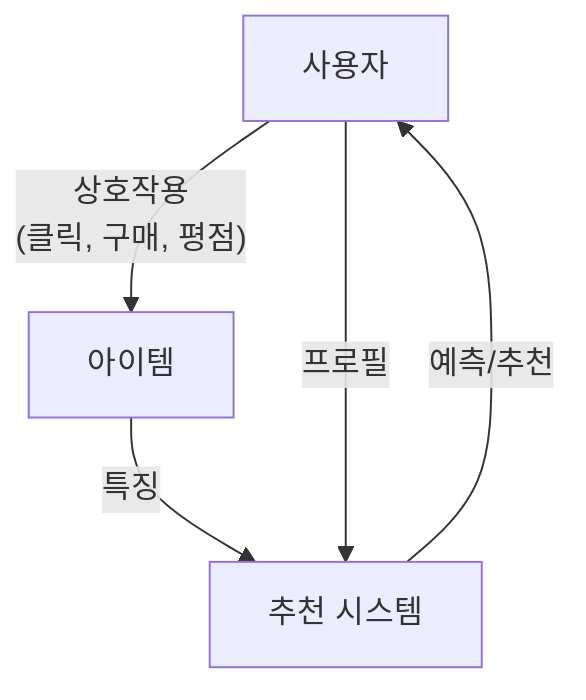
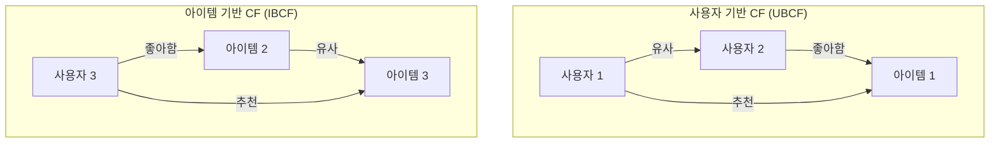
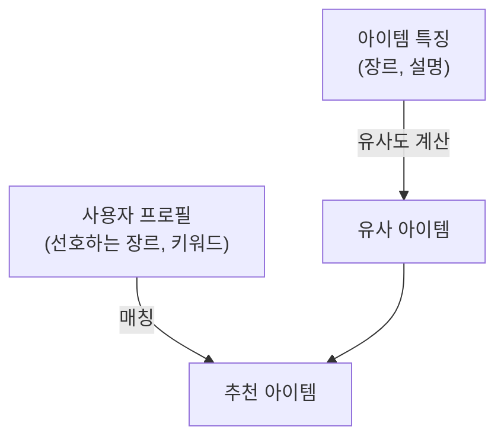
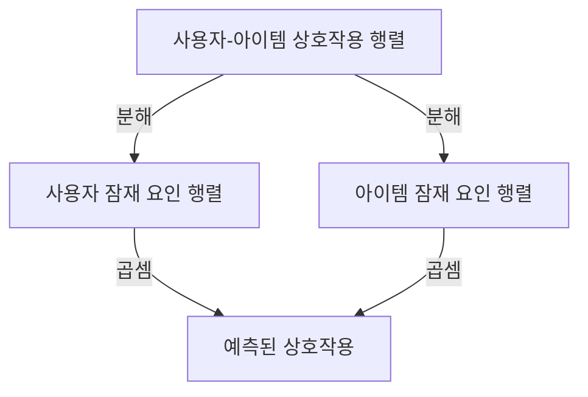
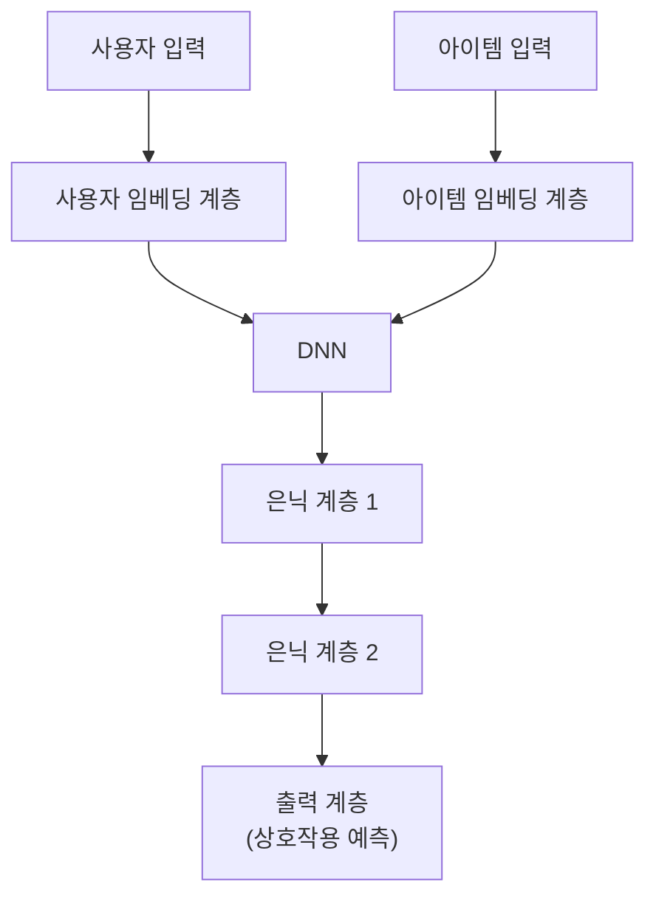
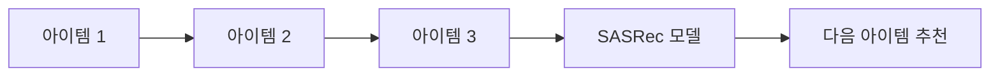
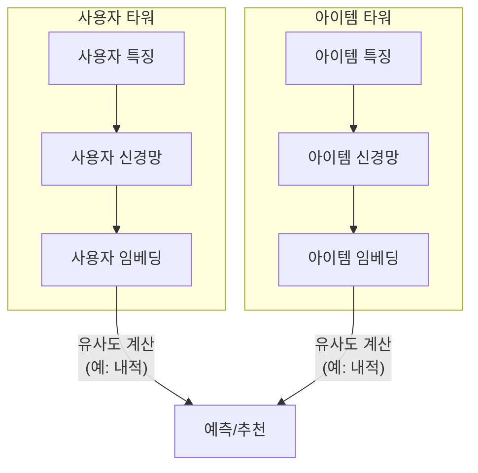
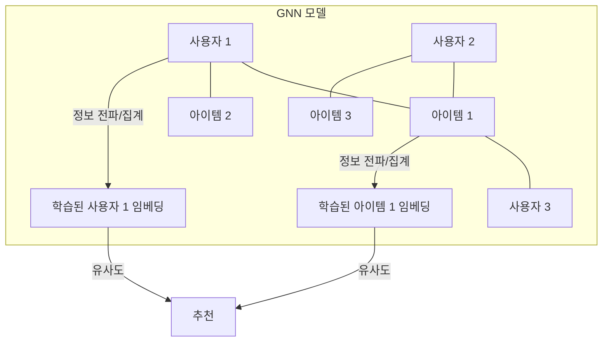

# 학습 경로: 추천 모델

추천 모델 학습 경로에 오신 것을 환영합니다! 이 가이드는 추천 시스템의 기본 개념을 이해하고 간단한 모델부터 복잡한 모델까지 다양한 모델에 대해 점진적으로 학습하는 데 도움이 되도록 설계되었습니다. 각 섹션에서는 개념적 설명을 제공하고 이 저장소의 관련 예제로 연결됩니다.

## 1. 추천 시스템 소개

추천 시스템은 사용자가 항목에 부여할 "평점" 또는 "선호도"를 예측하려는 정보 필터링 시스템의 한 유형입니다. 전자 상거래, 소셜 미디어 및 콘텐츠 플랫폼과 같은 다양한 애플리케이션에서 널리 사용됩니다.

**주요 개념:**

*   **명시적 피드백 (Explicit Feedback):** 사용자가 직접 선호도를 제공합니다 (예: 평점, 리뷰).
*   **암시적 피드백 (Implicit Feedback):** 사용자 행동에서 사용자 선호도를 유추합니다 (예: 클릭, 조회, 구매).
*   **콜드 스타트 문제 (Cold Start Problem):** 과거 데이터 부족으로 인해 신규 사용자 또는 신규 아이템에 대한 추천이 어려운 문제입니다.
*   **희소성 (Sparsity):** 사용자-아이템 상호 작용 행렬은 종종 희소하며, 이는 대부분의 사용자가 대부분의 아이템과 상호 작용하지 않았음을 의미합니다.
*   **확장성 (Scalability):** 추천 시스템은 대량의 데이터와 사용자를 효율적으로 처리해야 합니다.

**일반적인 추천 접근 방식 유형:**

*   **협업 필터링 (Collaborative Filtering):** 과거에 동의했던 사용자는 미래에도 동의할 것이라는 아이디어를 기반으로 합니다.
*   **콘텐츠 기반 필터링 (Content-Based Filtering):** 아이템 속성을 기반으로 사용자가 과거에 좋아했던 아이템과 유사한 아이템을 추천합니다.
*   **하이브리드 접근 방식 (Hybrid Approaches):** 협업 및 콘텐츠 기반 방법의 강점을 활용하고 약점을 완화하기 위해 이들을 결합합니다.

## 2. 기본 추천 모델

몇 가지 기본적인 추천 모델부터 시작하겠습니다.

### 2.1. 협업 필터링 (Collaborative Filtering - CF)

협업 필터링 기술은 사용자의 과거 행동 (이전에 구매했거나 선택한 아이템 및/또는 해당 아이템에 부여한 숫자 평점)과 다른 사용자가 내린 유사한 결정을 기반으로 모델을 구축합니다.

#### 2.1.1. 사용자 기반 협업 필터링 (User-Based Collaborative Filtering - UBCF)

*   **개념:** 유사한 사용자가 좋아했던 아이템을 사용자에게 추천합니다. 대상 사용자와 유사한 평점 패턴을 가진 사용자를 찾아 해당 평점을 사용하여 대상 사용자가 좋아할 만한 것을 예측합니다.
*   **예제:** [`examples/collaborative_filtering/user_cf_example.py`](examples/collaborative_filtering/user_cf_example.py)
*   **사용 시기:** 사용자 선호도가 비교적 안정적이고 관심사가 겹치는 사용자가 충분할 때 사용합니다.
*   **한계점:** 데이터 희소성 및 신규 사용자 콜드 스타트 문제가 있습니다. 사용자 수가 증가함에 따라 유사한 사용자를 찾는 데 계산 비용이 많이 듭니다.

#### 2.1.2. 아이템 기반 협업 필터링 (Item-Based Collaborative Filtering - IBCF)

*   **개념:** 사용자가 과거에 좋아했던 아이템과 유사한 아이템을 추천합니다. 사용자 평점 패턴을 기반으로 아이템 간의 유사성을 계산합니다.
*   **예제:** [`examples/collaborative_filtering/item_cf_example.py`](examples/collaborative_filtering/item_cf_example.py)
*   **사용 시기:** 아이템 특성이 비교적 안정적일 때 사용합니다. UBCF보다 확장 가능하고 안정적인 경우가 많습니다.
*   **한계점:** 데이터 희소성 및 신규 아이템 콜드 스타트 문제가 있습니다. 다양한 추천을 제공하지 못할 수 있습니다.

### 2.2. 콘텐츠 기반 필터링 (Content-Based Filtering)

콘텐츠 기반 필터링 방법은 아이템 설명과 사용자 선호도 프로필을 기반으로 합니다. 이러한 방법은 아이템에 대한 알려진 데이터(이름, 위치, 설명 등)는 있지만 사용자에 대한 데이터는 없는 상황에 가장 적합합니다.

#### 2.2.1. TF-IDF 기반 추천

*   **개념:** TF-IDF (Term Frequency-Inverse Document Frequency)를 사용하여 아이템 콘텐츠(예: 텍스트 설명, 장르)를 표현합니다. 그런 다음 사용자가 좋아했던 콘텐츠와 유사한 콘텐츠를 가진 아이템을 추천합니다.
*   **예제:** [`examples/content_based/tfidf_example.py`](examples/content_based/tfidf_example.py)
*   **사용 시기:** 아이템에 풍부한 텍스트 설명이 있을 때 사용합니다. 아이템 콜드 스타트 문제를 처리하는 데 좋습니다.
*   **한계점:** 특징 공학(feature engineering)에 크게 의존합니다. 사용자가 이미 알고 있는 것과 너무 유사한 아이템을 추천할 수 있습니다 (제한된 의외성).

### 2.3. 행렬 분해 (Matrix Factorization)

행렬 분해 기술은 사용자-아이템 상호 작용 행렬을 사용자와 아이템에 대한 저차원 잠재 요인 행렬로 분해합니다.

#### 2.3.1. 특이값 분해 (Singular Value Decomposition - SVD)

*   **개념:** 사용자-아이템 행렬을 세 개의 행렬로 분해하는 널리 사용되는 행렬 분해 기술입니다. 기본 사용자 선호도와 아이템 특성을 나타내는 잠재 요인을 포착합니다.
*   **예제:** [`examples/matrix_factorization/svd_example.py`](examples/matrix_factorization/svd_example.py)
*   **사용 시기:** 희소 데이터를 처리하고 잠재적 관계를 파악하는 데 효과적입니다.
*   **한계점:** 매우 큰 행렬의 경우 계산 집약적일 수 있습니다. 잠재 요인의 해석 가능성이 어려울 수 있습니다.

## 3. 고급 추천 모델

이러한 모델은 종종 머신 러닝 및 딥 러닝 기술을 활용하여 더 복잡한 패턴을 포착합니다.

### 3.1. 딥 러닝 기반 추천

딥 러닝 모델은 데이터로부터 복잡한 비선형 관계를 학습하여 더 정확한 추천을 할 수 있습니다.

#### 3.1.1. 임베딩을 사용한 심층 신경망 (Deep Neural Networks - DNN)

*   **개념:** 임베딩 계층을 사용하여 사용자와 아이템에 대한 밀집 벡터 표현(임베딩)을 학습합니다. 이러한 임베딩은 심층 신경망(DNN)에 입력되어 사용자-아이템 상호 작용(예: 평점)을 예측합니다.
*   **예제:** [`examples/deep_learning/dnn_recommender.py`](examples/deep_learning/dnn_recommender.py)

*   **사용 시기:** 상호 작용 데이터가 많을 때 사용합니다. 복잡한 패턴을 포착하고 다양한 특징을 쉽게 통합할 수 있습니다.
*   **한계점:** 상당한 데이터와 계산 리소스가 필요합니다. 해석 가능성 측면에서 "블랙 박스"가 될 수 있습니다. 콜드 스타트 문제가 있습니다.

### 3.2. 순차 추천 모델 (Sequential Recommendation Models)

순차 추천기는 사용자의 과거 상호 작용 순서를 기반으로 사용자의 다음 행동을 예측하는 것을 목표로 합니다.

#### 3.2.1. SASRec (Self-Attentive Sequential Recommendation)

*   **개념:** 사용자 행동의 순차적 패턴을 포착하기 위해 자기 주의 집중(self-attention) 메커니즘을 사용하는 Transformer 기반 모델입니다. 아이템 상호 작용의 순서와 맥락에 중점을 둡니다.
*   **예제:** [`examples/sequential/transformer_sasrec_example.py`](examples/sequential/transformer_sasrec_example.py)

*   **사용 시기:** 상호 작용 순서가 중요할 때 사용합니다 (예: 다음 노래, 비디오 또는 제품 추천).
*   **한계점:** 순차 데이터가 필요합니다. 매우 긴 시퀀스의 경우 계산 집약적일 수 있습니다.

### 3.3. 하이브리드 추천 모델 (Hybrid Recommendation Models)

하이브리드 모델은 두 가지 이상의 추천 기술을 결합하여 더 나은 성능을 달성하고 개별 방법의 한계를 극복합니다.

#### 3.3.1. 투 타워 하이브리드 모델 (Two-Tower Hybrid Model)

*   **개념:** 사용자를 위한 신경망과 아이템을 위한 신경망, 이렇게 두 개의 개별 신경망(타워)으로 구성됩니다. 각 타워는 해당 엔티티에 대한 임베딩을 학습합니다. 그런 다음 사용자 임베딩과 아이템 임베딩 간의 유사성을 추천에 사용합니다.
*   **예제:** [`examples/hybrid/two_tower_hybrid_example.py`](examples/hybrid/two_tower_hybrid_example.py)

*   **사용 시기:** 대규모 추천 시스템에 효과적입니다. 아이템 임베딩을 미리 계산하여 후보를 효율적으로 검색할 수 있습니다.
*   **한계점:** 사용자 특징과 아이템 특징 간의 상호 작용은 일반적으로 늦게 모델링되므로(예: 내적을 통해) 더 통합된 모델보다 표현력이 떨어질 수 있습니다.

### 3.4. 그래프 기반 추천 모델 (Graph-Based Recommendation Models - GNNs)

그래프 신경망(GNN)은 사용자-아이템 상호 작용을 그래프로 모델링하고 그래프 학습 기술을 추천에 활용합니다.

#### 3.4.1. LightGCN (Light Graph Convolution Network)

*   **개념:** 사용자-아이템 상호 작용 그래프에서 선형 전파를 수행하여 사용자 및 아이템 임베딩을 학습하는 단순화된 GNN 모델입니다. 기존 GCN에 사용되는 특징 변환 및 비선형성을 제거하여 추천에 더 효율적이고 종종 더 효과적입니다.
*   **예제:** [`examples/gnn/lightgcn_tf_example.py`](examples/gnn/lightgcn_tf_example.py)
*   **사용 시기:** 사용자-아이템 상호 작용을 자연스럽게 이분 그래프로 표현할 수 있을 때 사용합니다. 많은 벤치마크에서 강력한 성능을 보여주었습니다.
*   **한계점:** 계층이 너무 많으면 과도한 평활화(over-smoothing) 문제가 발생할 수 있습니다.

#### 3.4.2. NGCF (Neural Graph Collaborative Filtering)

*   **개념:** 임베딩을 전파하여 사용자-아이템 그래프에서 고차 연결성을 명시적으로 모델링합니다. 더 복잡한 협업 신호를 포착하는 것을 목표로 합니다.
*   **예제:** [`examples/gnn/ngcf_example.py`](examples/gnn/ngcf_example.py) (참고: 이 예제는 자리 표시자이거나 단순화된 버전일 수 있습니다. 전체 구현 세부 정보는 논문에 있습니다.)
*   **사용 시기:** 상호 작용 그래프에서 고차 관계를 탐색하는 것이 유익할 때 사용합니다.
*   **한계점:** LightGCN보다 더 복잡하고 계산 집약적일 수 있습니다.

#### 3.4.3. PinSage

*   **개념:** Pinterest에서 대규모 그래프에 대한 웹 스케일 추천을 위해 개발한 GNN 모델입니다. 랜덤 워크와 중요도 풀링을 사용한 그래프 컨볼루션을 사용하여 아이템 임베딩을 생성합니다.
*   **예제:** [`examples/gnn/pinsage_example.py`](examples/gnn/pinsage_example.py) (참고: 이 예제는 자리 표시자이거나 단순화된 버전일 수 있습니다. 전체 구현 세부 정보는 논문에 있습니다.)
*   **사용 시기:** 풍부한 아이템 특징과 그래프 구조를 가진 매우 큰 규모의 산업용 애플리케이션에 사용합니다.
*   **한계점:** 구현 및 학습이 복잡합니다. 상당한 계산 리소스가 필요합니다.

#### 3.4.4. 추천을 위한 GCN (Graph Convolutional Network)

*   **개념:** 사용자-아이템 상호 작용 그래프에 적용되는 일반적인 GCN입니다. 이웃 노드의 정보를 집계하여 임베딩을 학습합니다.
*   **예제:** [`examples/gnn/gcn_example.py`](examples/gnn/gcn_example.py) (참고: 이 예제는 자리 표시자이거나 단순화된 버전일 수 있습니다.)
*   **사용 시기:** 추천 작업을 위한 기본적인 GNN 접근 방식으로 사용합니다.
*   **한계점:** 표준 GCN에는 LightGCN과 같은 특수 모델에 비해 추천에 항상 최적이 아닌 구성 요소(비선형성, 특징 변환)가 포함될 수 있습니다.

#### 3.4.5. 추천을 위한 GraphSAGE

*   **개념:** 노드의 로컬 이웃에서 특징을 샘플링하고 집계하여 임베딩을 생성하는 함수를 학습하는 귀납적 GNN 모델입니다. 보이지 않는 노드에 대한 임베딩을 생성할 수 있습니다.
*   **예제:** [`examples/gnn/graphsage_example.py`](examples/gnn/graphsage_example.py) (참고: 이 예제는 자리 표시자이거나 단순화된 버전일 수 있습니다.)
*   **사용 시기:** 진화하는 그래프를 다루거나 새로운 사용자/아이템에 대한 임베딩을 생성해야 할 때(귀납적 기능) 사용합니다.
*   **한계점:** 성능은 집계기 및 샘플링 전략 선택에 따라 달라질 수 있습니다.

#### 3.4.6. 추천을 위한 GAT (Graph Attention Network)

*   **개념:** 그래프 컨볼루션에 주의 집중 메커니즘을 통합하여 노드가 정보 집계 중에 이웃에 다른 가중치를 할당할 수 있도록 합니다.
*   **예제:** [`examples/gnn/gat_example.py`](examples/gnn/gat_example.py) (참고: 이 예제는 자리 표시자이거나 단순화된 버전일 수 있습니다.)
*   **사용 시기:** 노드 표현에 대해 다른 이웃이 다양한 중요도를 가질 때 사용합니다.
*   **한계점:** 더 간단한 GCN 모델보다 계산 비용이 더 많이 들 수 있습니다.

## 4. 추천 시스템의 데이터 엔지니어 되기

추천 시스템을 다루는 데이터 엔지니어로서 탁월해지려면 다음 분야에 집중하는 것을 고려하십시오.

*   **데이터 이해:** 사용자 행동, 아이템 특성 및 상호 작용 패턴을 심층적으로 분석합니다.
*   **데이터 파이프라인:** 모델 학습 및 제공을 위해 데이터를 수집, 처리 및 변환하기 위한 강력하고 확장 가능한 데이터 파이프라인을 구축합니다.
*   **특징 공학 (Feature Engineering):** 모델 성능을 향상시킬 수 있는 의미 있는 특징을 만듭니다.
*   **모델 평가:** 다양한 평가 지표(예: Precision@K, Recall@K, NDCG, MAE, RMSE)와 비즈니스 목표의 맥락에서 이를 해석하는 방법을 이해합니다.
*   **확장성 및 효율성:** 대규모 사용자 기반 및 아이템 카탈로그를 처리하고 짧은 대기 시간으로 추천을 제공할 수 있는 시스템을 설계합니다.
*   **오프라인 대 온라인 평가:** 과거 데이터(오프라인)로 모델을 평가하는 것과 실제 환경(온라인 A/B 테스트)에서 테스트하는 것의 차이점을 이해합니다.
*   **최신 정보 유지:** 추천 시스템 분야는 빠르게 발전하고 있습니다. 최신 연구 논문과 업계 모범 사례를 통해 최신 정보를 유지하십시오.

이 학습 경로는 시작점을 제공합니다. 예제를 살펴보고 코드를 실험하며 추가 리소스를 탐색하여 이해를 넓히십시오. 행운을 빕니다!
